# Precise Paddy Fertilizer Recommendation System

This project focused on optimizing agricultural productivity through data-driven soil analysis and precision fertilizer recommendations. Using drones equipped with soil sensors, nutrient data was collected and transmitted via LoRa to a cloud-based database (Supabase). The data was preprocessed, analyzed using neural networks for yield prediction, and optimized using the Cuckoo Search algorithm to determine ideal fertilizer doses. Spatial interpolation techniques (IDW, Kriging) generated nutrient distribution maps, aiding farmers in targeted fertilization.

- **Web Application:** Developed with Streamlit, the system provides an interactive visualization of soil health and optimal fertilizer plans.
- **Drone Path-Planning:** An efficient drone path-planning algorithm was implemented to enhance automated data collection.
- **Integration:** The system successfully integrates machine learning and optimization techniques to support sustainable and cost-effective agricultural practices.

## Hardware

**Figure 1: Schematic of soil sensor node**  
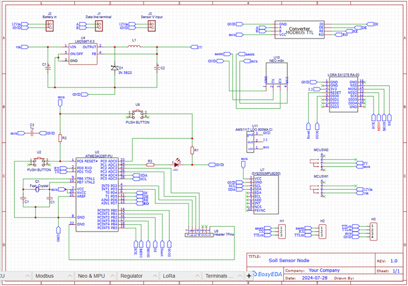

## Data Cleaning & Preprocessing

- **Mean Substitution:** Applied to replace missing values, preserving dataset integrity.
- **Outlier Detection:** Identified using box plots and the interquartile range (IQR) method.
- **Handling Extreme Values:** Adjusted within upper/lower bounds instead of being removed to retain data completeness.
- **Correlation Analysis:** A correlation matrix was plotted to reduce multicollinearity and focus on impactful variables.
- **Data Transformations:** Logarithmic and cube-root transformations were applied to normalize skewed data distributions.
- **Encoding:**  
  - Label encoding for temporal categorical features.  
  - One-hot encoding for non-sequential categorical data.
- **Standardization:** Standard Scaler was used to standardize data, ensuring uniform feature scaling and preventing dominance by any single feature.

## Predictive Model Development

- **Dataset:** 20,000 data points from various agricultural regions.
- **Hyperparameter Tuning:** GridSearchCV was used to fine-tune hyperparameters.
- **Overfitting Prevention:** Early Stopping and Learning Rate Reduction on Plateau were implemented.
- **Model Architectures:** Various neural network architectures were tested to balance model complexity and performance.
- **Error Analysis:** The number of layers and perceptrons were plotted against the error by training various configurations, reinforcing the results of GridSearchCV and ensuring a balanced contribution from all input features.

**Figure 2: Validation Error vs Total neurons in model by training multiple neural network configurations**  
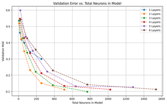

**Figure 3: Validation Error vs No of layers in model by training multiple neural network configurations**  
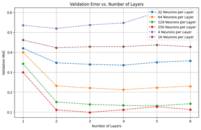

**Figure 4: Weights of input features**  
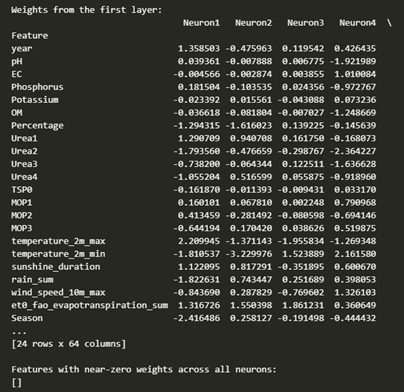

## Yield Prediction Model Performance Summary

### Model Accuracy & Generalization

- **High Predictive Accuracy:**  
  - R² values of **0.9264 (train)** and **0.9253 (test)**, explaining over 92% of yield variance.
  - Training and validation loss steadily decreased, indicating effective learning and minimal overfitting.
  - Predicted values closely aligned with actual values, demonstrating a strong relationship between input features and crop yield.

### Error Metrics & Robustness

- **Low Error Values:**  
  - RMSE of **230.59** on test data.
  - MAE of **170.37**, ensuring precise predictions.
- **Sensitivity Analysis:**  
  - Resilience at **2% Gaussian noise**, with slight performance degradation at **5% noise**.
  - Minimal bias observed in residual distributions, indicating random error without systematic bias.

### Comparison with Baseline Models

- **Neural Network vs. Linear Regression:**  
  - The Neural Network significantly outperformed Linear Regression (R² of only **0.62** for the latter), with lower RMSE, MAE, and MAPE values.

### Generalization on Unseen Data (2023 Evaluation)

- When tested on 2023 data:
  - RMSE increased to **369.71**.
  - R² dropped to **0.75**, highlighting challenges in adapting to new, unseen conditions.
- Despite these challenges, the model retained acceptable accuracy, showing potential for real-world applications with further tuning.

The graphs below illustrate how yield is influenced by variations in fertilizer doses under specific soil and environmental conditions. These results stem from the model trained primarily for yield prediction.

## Cuckoo Search Optimization (CSO)

The Cuckoo Search Optimization algorithm was crucial for determining the appropriate doses of fertilizer, as the yield does not linearly correlate with the amount of each fertilizer dose. By leveraging CSO, we efficiently navigated through complex, non-linear relationships to optimize fertilizer applications, ensuring maximum yield without waste or environmental impact. 

**Figure 5**  
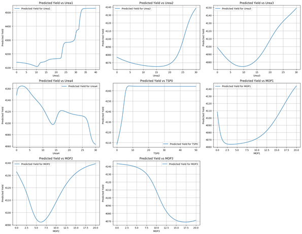

*Note: Being a probabilistic algorithm, CSO may yield slightly different outcomes on each run due to randomization. Multiple runs were required to achieve stable recommendations (convergence).*

**Figure 6**  
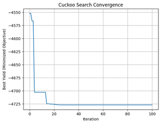

## Web Application Development using Streamlit

An interactive web application was developed using Streamlit to visualize soil health and display optimal fertilizer plans based on the processed data and model predictions.

**Figure 7: Use case diagram**  
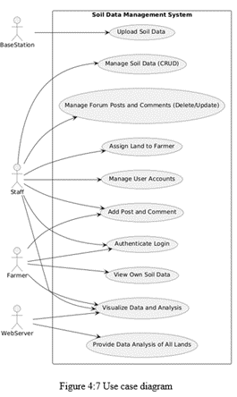

**Figure 8: Class diagram**  
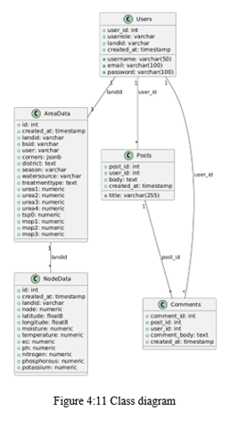

**Figure 9: Sequence diagram of user viewing data**  
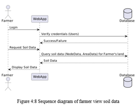

**Figure 10: Sequence diagram of admin performing CRUD operations**  
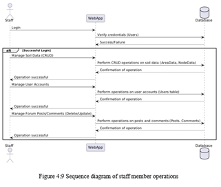

## IDW of Soil Nutrient Profile and Fertilizer Map

Spatial interpolation using Inverse Distance Weighting (IDW) was applied to generate nutrient distribution maps, aiding in targeted fertilization strategies.

**Figure 11: Existing soil nutrient profile**  
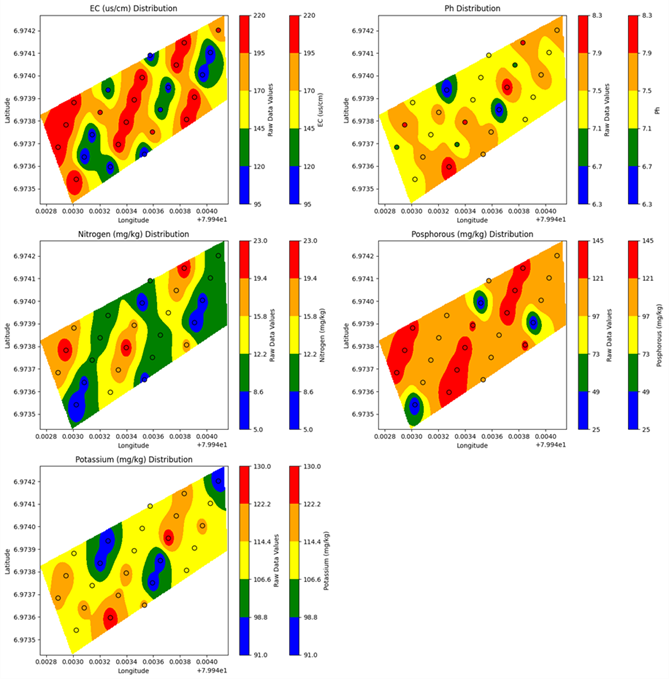

**Figure 12: Fertilizer application map**  
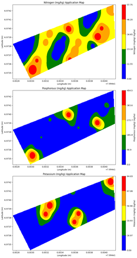

## Path Planning

- By using **BFS (Breadth-First Search)**, the algorithm thoroughly checks all possible paths to ensure that drones can travel to many locations from a starting point and return safely without running out of battery. It plans routes that cleverly avoid any blockages, ensuring efficient navigation without interruptions. Moreover, simple calculations determine the shortest and most practical routes for the drones.
- This approach ensures that drones always take the best path available, saving both time and battery power. The path of a land using 2 drones with obstacles and limited drone distance per charge is illustrated below.

**Figure 13**  

**Figure 14**  
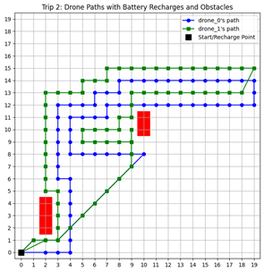
